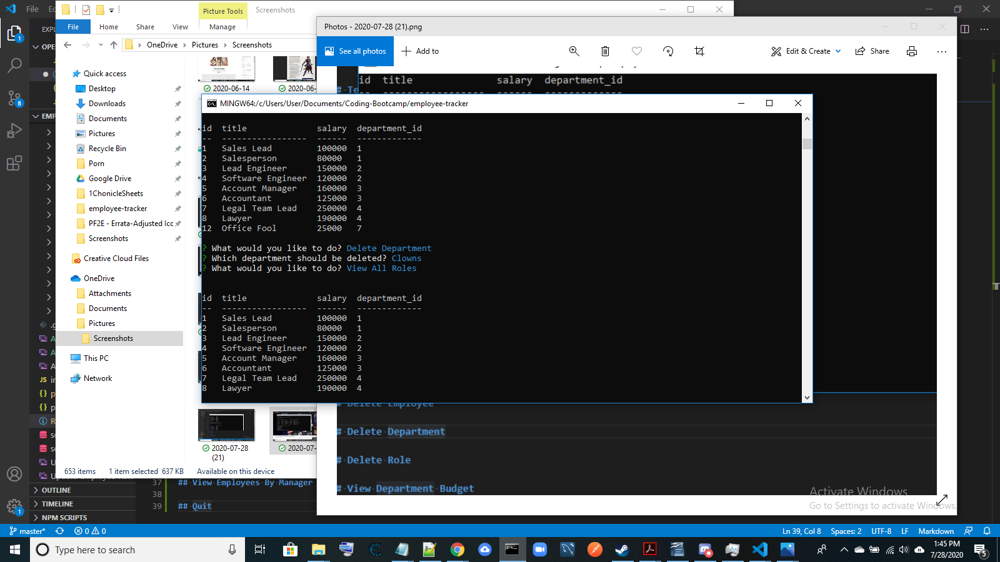
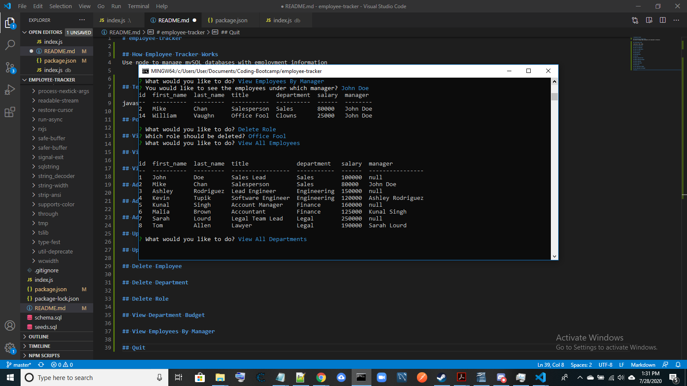
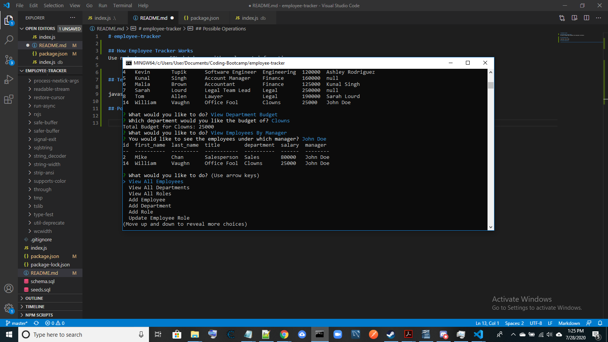

# Employee Tracker

## How Employee Tracker Works
Use node to manage MySQL databases with employment information.

## Technologies Used

javascript, node, MySQL

## Possible Operations
Here is a list of all operations and an example execution of them

## View All Employees
Show all employees in database

## View All Departments
Show all departments in database

## View All Roles
Show all roles in database

## Add Employee
Add employee to database by asking for thier name, role, and manager.

## Add Department
Add department to database.

## Add Role
Add role to database by asking for its title, salary, and department.

## Update Employee Role
Changes an employees role to another role in the database

## Update Employee Manager
Changes an employee's manager to another employee in the database

## Delete Employee
Deletes the chosen employee from the database.  Note, due to the database's setup deleting an employee does not reset the numerical id of employees after it.

## Delete Department
Deletes the chosen department along with any roles in that department and any employees in those roles from the database.  Note, due to the database's setup deleting a department does not reset the numerical id of departments after it.

## Delete Role
Deletes the chosen role from the database along with any employees in that role.  Note, due to the database's setup deleting a role does not reset the numerical id of roles after it.

## View Department Budget
Display the total salary of all employees under the chosen department.

## View Employees By Manager
Displays all employees who are managed by the chosen employee.

## Quit
